# Nimonspedia - Platform E-Commerce

## Deskripsi Aplikasi Web

Nimonspedia adalah platform e-commerce yang memungkinkan pengguna untuk membeli dan menjual produk secara online. Aplikasi ini dibangun menggunakan arsitektur modern dengan PHP, PostgreSQL, dan Nginx yang di-containerize menggunakan Docker.

### Fitur Utama:
- **Untuk Buyer:**
  - Registrasi dan login
  - Pencarian produk dengan full-text search
  - Melihat detail produk dan toko
  - Keranjang belanja
  - Checkout dan manajemen pesanan
  - Riwayat pembelian
  - Top-up saldo
  - Ubah password

- **Untuk Seller:**
  - Dashboard penjualan dengan statistik
  - Manajemen produk (CRUD)
  - Manajemen pesanan
  - Export laporan ke CSV
  - Update profil toko

## Daftar Requirement

### Software:
- Docker Desktop (versi 20.10 atau lebih baru)
- Docker Compose (versi 1.29 atau lebih baru)
- Browser modern (Chrome, Firefox, Edge, Safari)

### Port yang Digunakan:
- `8082` - Nginx Web Server
- `5433` - PostgreSQL Database

## Cara Instalasi

1. **Clone Repository**
   ```bash
   git clone <repository-url>
   cd milestone-1-tugas-besar-if-3110-web-based-development-k02-12
   ```

2. **Pastikan Docker Desktop Sudah Berjalan**
   - Buka Docker Desktop
   - Pastikan Docker daemon aktif

3. **Build dan Jalankan Container**
   ```bash
   docker-compose up -d --build
   ```

4. **Setup Permission untuk Upload Folder**
   ```bash
   docker exec -it milestone-1-tugas-besar-if-3110-web-based-development-k02-12-php-1 bash
   chown -R www-data:www-data /var/www/html/public/uploads
   chmod -R 755 /var/www/html/public/uploads
   exit
   ```

5. **Verifikasi Container Berjalan**
   ```bash
   docker-compose ps
   ```
   Pastikan semua container berstatus "Up"

## Cara Menjalankan Server

### Menjalankan Server:
```bash
docker-compose up -d
```

### Menghentikan Server:
```bash
docker-compose down
```

### Melihat Logs:
```bash
docker-compose logs -f
```

### Akses Aplikasi:
Buka browser dan akses: `http://localhost:8082`

### Akses Database (untuk debugging):
```bash
docker exec -it milestone-1-tugas-besar-if-3110-web-based-development-k02-12-database-1 psql -U user -d nimonspedia
```

## Tangkapan Layar Aplikasi


### 1. Halaman Discovery (Beranda)
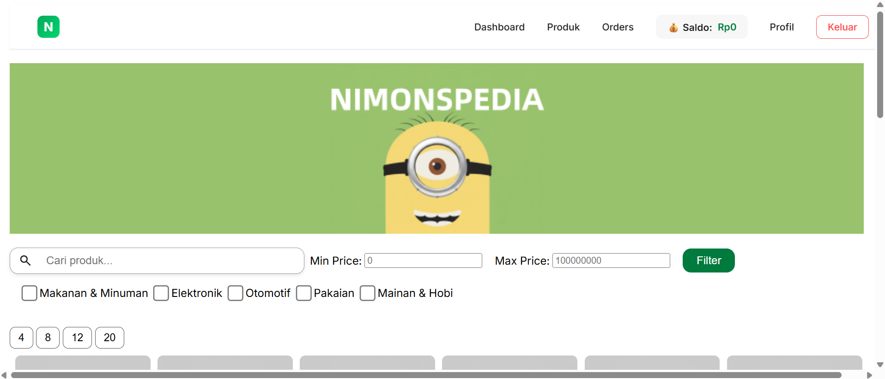
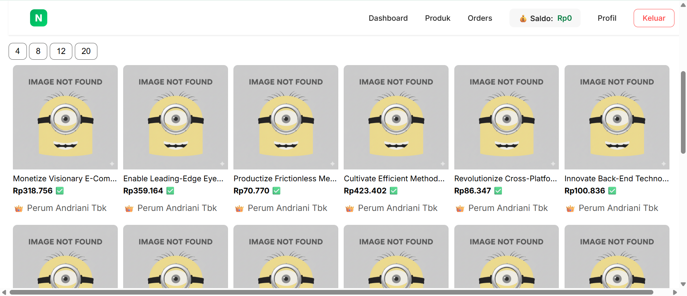
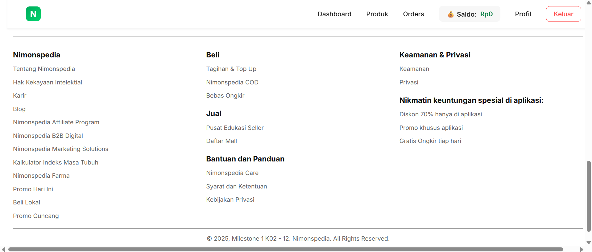

*Halaman utama untuk melihat dan mencari produk dengan fitur filter*

### 2. Halaman Login
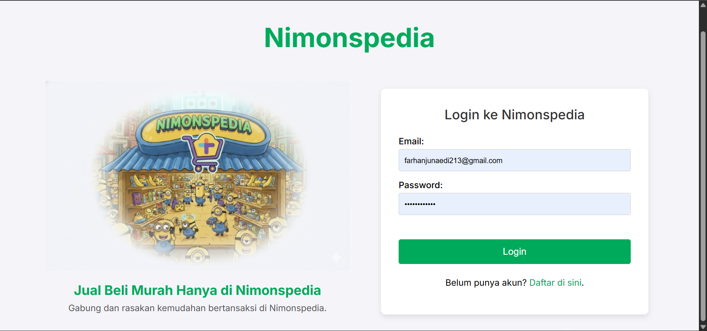

*Halaman login untuk buyer dan seller*

### 3. Halaman Register Buyer
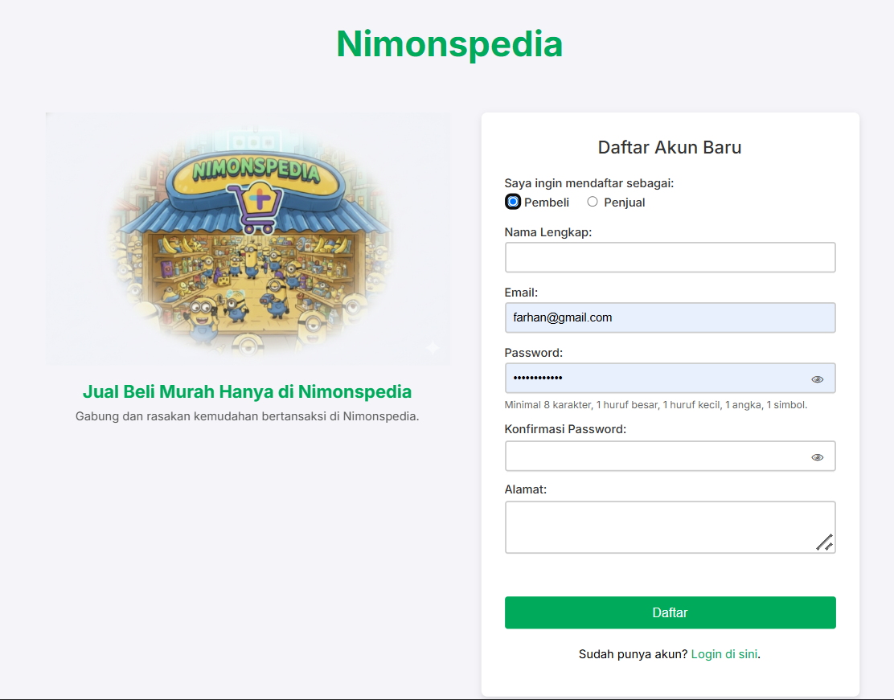

*Halaman registrasi akun buyer*

### 4. Halaman Register Seller
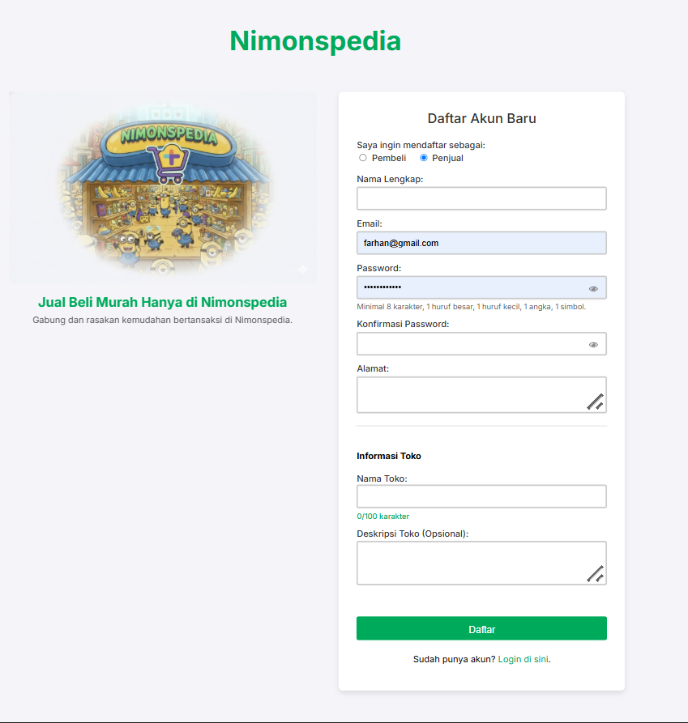

*Halaman registrasi akun seller beserta pembuatan toko*

### 5. Halaman Discovery


*Halaman utama untuk melihat dan mencari produk dengan fitur filter*

### 6. Halaman Detail Produk
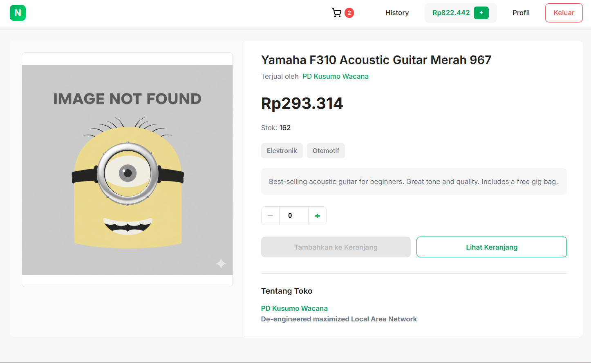

*Detail lengkap produk dengan informasi toko*

### 7. Halaman Detail Toko
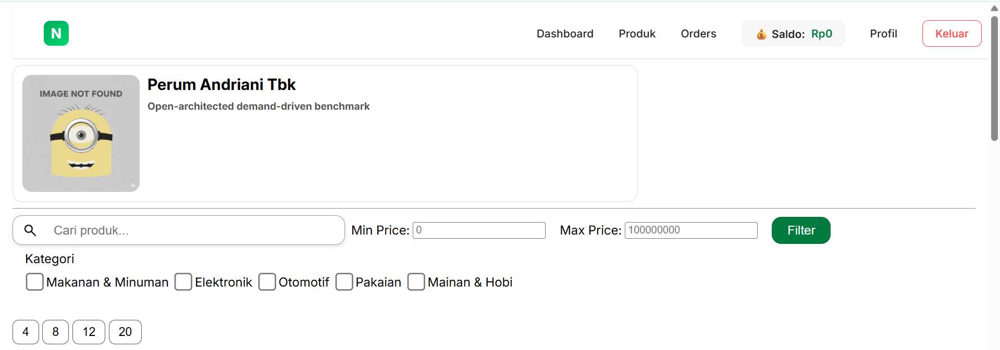


*Detail lengkap toko dan produk-produk yang dijual*

### 8. Halaman Keranjang Belanja
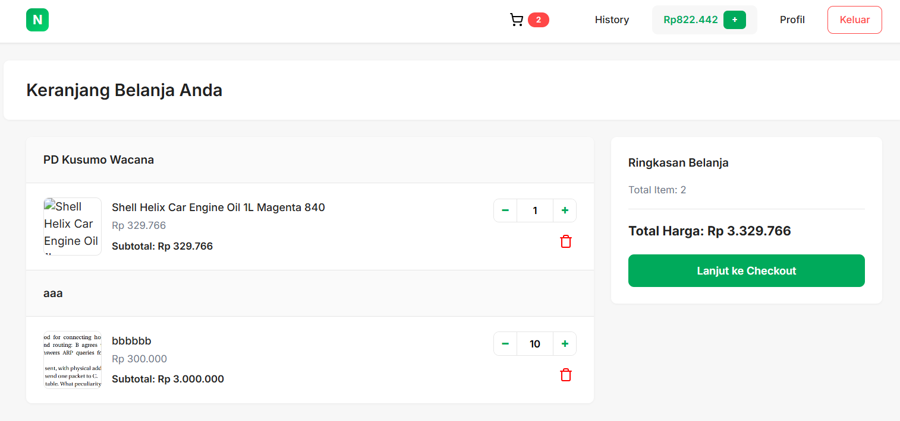

*Manajemen item di keranjang belanja*

### 9. Halaman Checkout
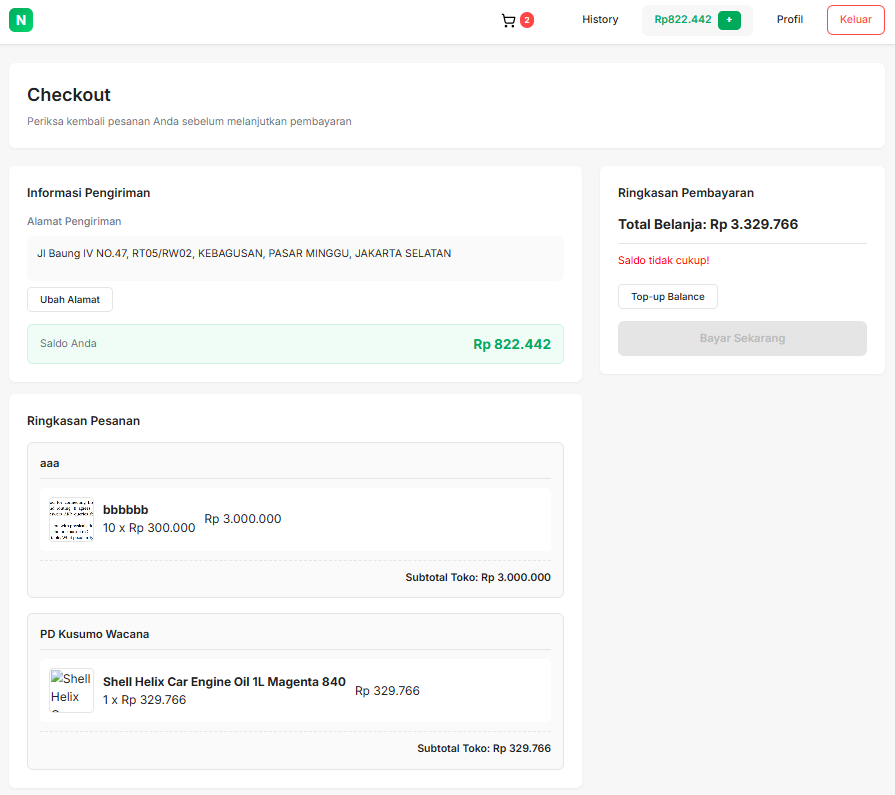

*Proses pembayaran dan pengiriman*

### 10. Dashboard Seller
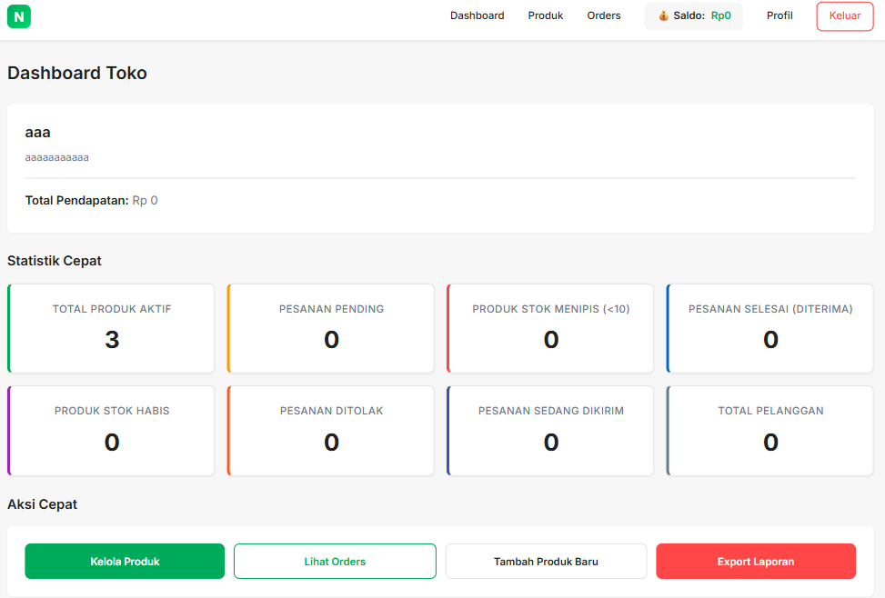

*Dashboard penjual dengan statistik lengkap dan tombol export CSV*

### 11. Manajemen Produk Seller
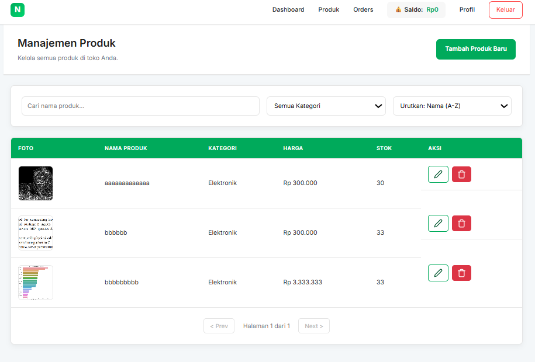

*Halaman untuk mengelola produk (tambah, edit, hapus)*

### 12. Manajemen Pesanan Seller
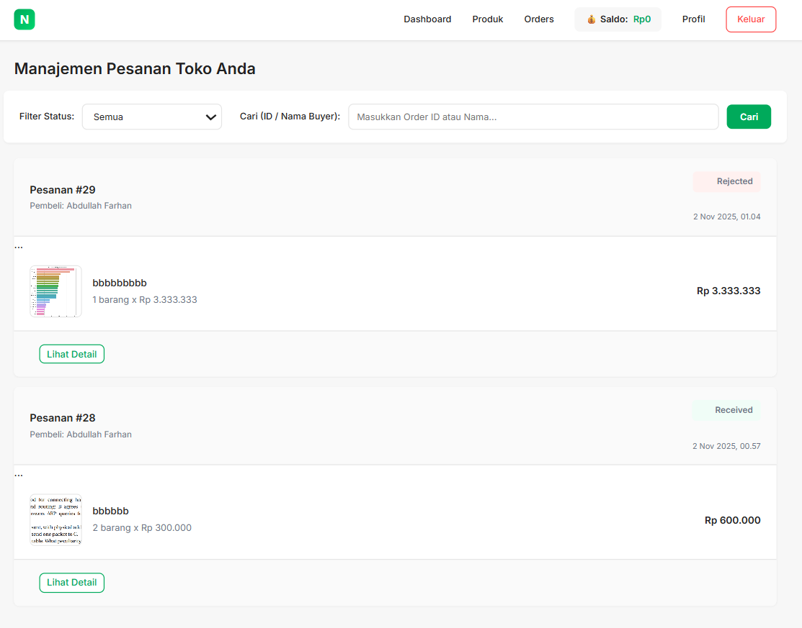

*Halaman untuk mengelola pesanan masuk*

### 13. Profil Buyer
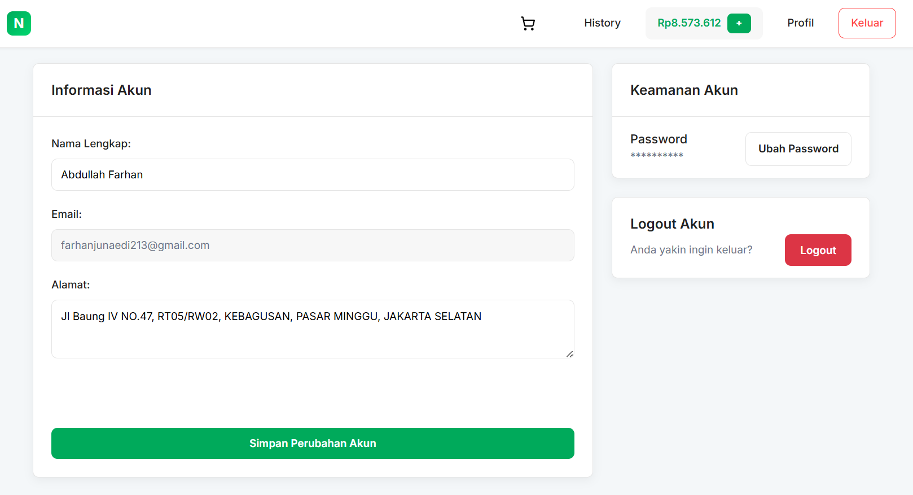

*Halaman profil Buyer*

### 14. Profil Seller
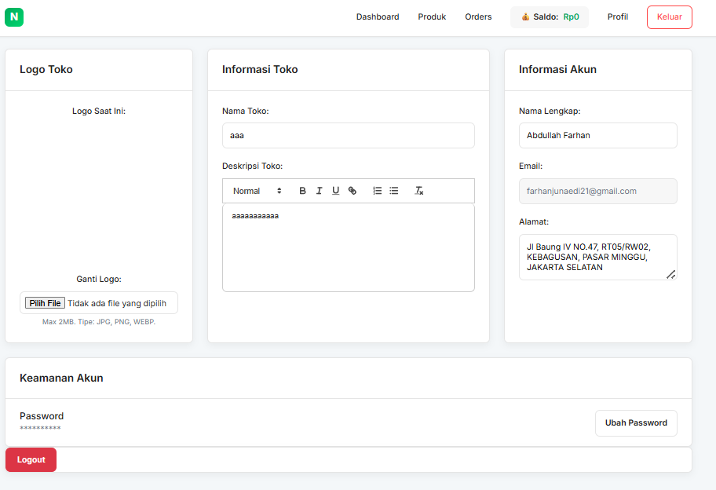

*Halaman profil Seller*

### 15. Order History
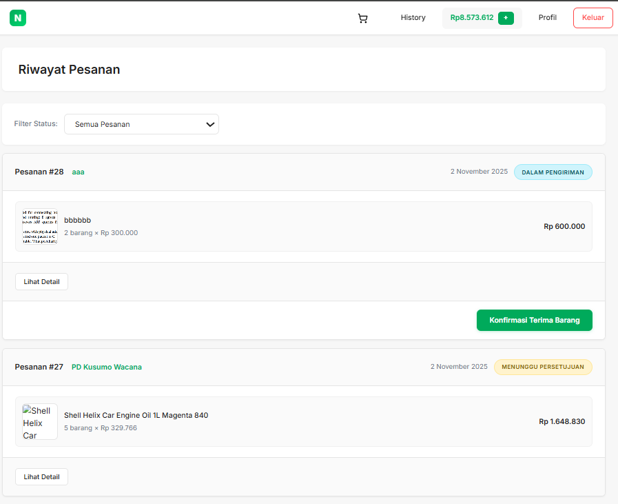

*Halaman riwayat pembelian dengan detail pesanan*

### 16. Top-up Balance
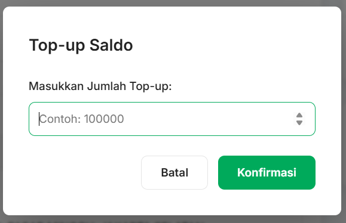

*Modal untuk menambah saldo akun buyer*

### 17. Change Password
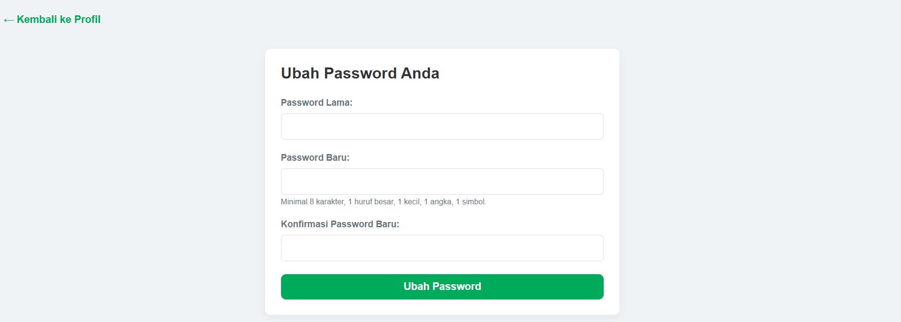


## Pembagian Tugas

| NIM | Nama | Tugas |
|-----|------|-------|
| 13523038 | Abrar Abhirama Widhyadhana | Setup Docker & Database, API Authentication, Halaman Login & Register |
| 13523042 | Abdullah Farhan | Frontend Discovery Page, Product Detail, Cart & Checkout System |
| 13523066 | Muhammad Ghifary Komara Putra | Seller Dashboard, Product Management, Order Management, Export CSV Feature |

### Detail Pembagian Tugas:
### Abrar: Autentikasi & Manajemen Pengguna (Fokus: User & Store Setup)

#### Server-side:
- ✅ API Login (Buyer & Seller)
- ✅ API Register (Buyer & Seller) - termasuk pembuatan data toko untuk Seller
- ✅ API Logout
- ✅ Session Management (PHP SESSION)
- ✅ Password Hashing
- ✅ API Update Profil (Buyer & Seller) - kecuali email
- ✅ API Add Product (Seller) - termasuk file upload handling
- ✅ API Edit Product (Seller) - termasuk image replacement handling
- ✅ API Soft Delete Product
- ✅ Penyimpanan File Binary (gambar produk, logo toko)

#### Client-side:
- ✅ Halaman Login (Buyer & Seller)
- ✅ Halaman Register (Buyer & Seller)
- ✅ Halaman Profile (Buyer) - termasuk form ubah password
- ✅ Halaman Add Product (Seller)
- ✅ Halaman Edit Product (Seller)
- ✅ Integrasi Quill.js untuk rich text editor
- ✅ Validasi client-side untuk semua form yang ditangani

#### Fokus Database:
Tabel `Users`, Tabel `Store`, Tabel `Product` (operasi CUD)

**File yang dikerjakan:**
- `api/login.php`
- `api/register.php`
- `api/logout.php`
- `api/update_profile.php`
- `api/update_store_profile.php`
- `api/add_product_process.php`
- `api/update_product_process.php`
- `api/delete_product.php`
- `api/change_password.php`
- `login.php` & `public/auth.js`
- `register.php` & `public/auth.js`
- `profile.php` & `public/profile.js`
- `change_password.php` & `public/change_password.js`
- `add_product.php` & `public/add_product.js`
- `edit_product.php` & `public/edit_product.js`
- `style/login.css`, `style/register.css`, `style/profile.css`

---

### Ghifary: Product Discovery & Shopping Experience (Fokus: Buyer Journey Awal)

#### Server-side:
- ✅ API Product Discovery (Home Buyer) - search, filter, Server-side Pagination
- ✅ API Detail Produk (Buyer)
- ✅ API Detail Store (Buyer)
- ✅ API Add to Cart
- ✅ API Update Quantity di Shopping Cart
- ✅ API Delete Item dari Shopping Cart

#### Client-side:
- ✅ Navigation Bar (Guest, Buyer, Seller) - termasuk badge counter cart
- ✅ Halaman Product Discovery / Home (Buyer) - loading skeleton, empty state
- ✅ Halaman Detail Produk (Buyer) - termasuk form add to cart
- ✅ Halaman Detail Store (Buyer)
- ✅ Responsivitas untuk Halaman Product Discovery dan Halaman Detail Produk
- ✅ Validasi client-side untuk semua form yang ditangani

#### Fokus Database:
Tabel `Product` (operasi R), Tabel `Category`, Tabel `Category_Item`, Tabel `Cart_Item`

**File yang dikerjakan:**
- `api/get_discovery_product.php`
- `api/get_product_details.php`
- `api/get_store_details_info.php`
- `api/add_to_cart.php` (implied)
- `api/update_cart_item.php`
- `api/delete_cart_item.php`
- `component/navbar.php` & `api/get_navbar_data.php`
- `discovery.php` & `public/discovery.js`
- `product_details.php` & `public/product_details.js`
- `store_details.php` & `public/store_details.js`
- `component/discovery_cards.php`
- `component/store_details_cards.php`
- `style/navbar.css`, `style/discovery.css`, `style/product_details.css`, `style/store_details.css`, `style/card.css`

---

### Farhan: Order Fulfillment & Dashboard (Fokus: Transaksi & Manajemen Lanjutan)

#### Server-side:
- ✅ API View Shopping Cart
- ✅ API Update Quantity di Shopping Cart
- ✅ API Delete Item dari Shopping Cart
- ✅ API Top-up Balance (Buyer)
- ✅ API Checkout (Buyer) - validasi balance & stok, hold balance, kurangi stok, buat order per toko
- ✅ API Order History (Buyer) - filter, sort
- ✅ API Konfirmasi Penerimaan Barang (Buyer)
- ✅ API Dashboard Seller - menghitung quick stats
- ✅ API Order Management (Seller) - filter/tab status, approve/reject order, set delivery time
- ✅ API Refund Balance (Buyer) saat order di-reject Seller

#### Client-side:
- ✅ Navigation Bar (Guest, Buyer, Seller) - termasuk badge counter cart
- ✅ Halaman Shopping Cart (Buyer) - confirmation dialog saat hapus item
- ✅ Halaman Checkout (Buyer) - ringkasan order, info alamat, balance info, confirmation modal
- ✅ Halaman Order History (Buyer) - detail order, tampilan refund
- ✅ Halaman Dashboard (Seller) - quick stats cards, quick actions buttons
- ✅ Halaman Order Management (Seller) - tabel order, tombol approve/reject/set delivery, modal input
- ✅ Halaman Product Management (Seller) - tabel produk dengan pagination
- ✅ Pagination untuk Halaman Order Management (Seller)
- ✅ Error Handling dan State Indicator di seluruh aplikasi
- ✅ Validasi client-side untuk semua form yang ditangani

#### Spesifikasi Bonus:
- ✅ **Advanced Search** - Full-text search dengan PostgreSQL `tsvector`
- ✅ **Export to CSV** - Export statistik dashboard seller ke CSV

#### Fokus Database:
Tabel `Order`, Tabel `Order_Items`, Tabel `Users` (balance), Tabel `Product` (stock)

**File yang dikerjakan:**
- `api/get_cart.php`
- `api/topup_balance.php`
- `api/get_checkout_data.php`
- `api/checkout_process.php`
- `api/get_order_history.php` (implied)
- `api/confirm_receipt.php`
- `api/get_dashboard_stats.php`
- `api/get_seller_orders.php`
- `api/get_seller_product.php`
- `api/approve_order.php`
- `api/reject_order.php`
- `api/set_delivery.php`
- `cart.php` & `public/cart.js`
- `checkout.php` & `public/checkout.js`
- `order_history.php` & `public/order_history.js`
- `dashboard.php` & `public/dashboard.js`
- `order_management.php` & `public/order_management.js`
- `product_management.php` & `public/product_management.js`
- `style/cart.css`, `style/checkout.css`, `style/order_history.css`, `style/dashboard.css`, `style/order_management.css`, `style/product_management.css`

## Bonus yang Dikerjakan

### 1. Advanced Search dengan Full-Text Search (FTS)

**Implementasi:**
- Menggunakan PostgreSQL Full-Text Search dengan `tsvector` dan `tsquery`
- Kolom `search_vector` otomatis di-update menggunakan trigger
- Pencarian mencakup nama produk, deskripsi, dan tags

**Kode Penting:**

Database Schema:
```sql
CREATE TABLE Product (
  -- ... kolom lainnya ...
  tags TEXT[] NULL,
  search_vector tsvector,
  -- ... kolom lainnya ...
);

CREATE OR REPLACE FUNCTION update_product_search_vector()
RETURNS TRIGGER AS $$
BEGIN
  NEW.search_vector := to_tsvector('english', 
    COALESCE(NEW.product_name, '') || ' ' || 
    COALESCE(NEW.description, '') || ' ' || 
    COALESCE(array_to_string(NEW.tags, ' '), '')
  );
  RETURN NEW;
END;
$$ LANGUAGE plpgsql IMMUTABLE;

CREATE TRIGGER product_search_vector_update
BEFORE INSERT OR UPDATE ON Product
FOR EACH ROW
EXECUTE FUNCTION update_product_search_vector();

CREATE INDEX idx_product_search ON Product USING GIN (search_vector);
```

API Implementation (`api/get_discovery_product.php`):
```php
if (!empty($search)) {
    $searchFilter = "AND p.search_vector @@ plainto_tsquery('english', ?)";
    $params[] = $search;
}
```

**Keunggulan:**
- Pencarian lebih cepat dan efisien
- Support pencarian partial dan fuzzy matching
- Dapat mencari dalam multiple fields sekaligus

### 2. Export Dashboard Statistics ke CSV

**Implementasi:**
- Tombol export di dashboard seller
- Generate CSV file dengan statistik lengkap
- Nama file dinamis dengan format: `Laporan_NamaToko_YYYY-MM-DD.csv`

**Kode Penting:**

Backend API (`api/get_dashboard_stats.php`):
```php
// Statistik yang dikumpulkan:
$stats['total_products'] = // Total produk aktif
$stats['pending_orders'] = // Pesanan pending
$stats['low_stock_products'] = // Produk stok < 10
$stats['completed_orders'] = // Pesanan selesai
$stats['out_of_stock_products'] = // Produk stok habis
$stats['rejected_orders'] = // Pesanan ditolak
$stats['on_delivery_orders'] = // Pesanan dalam pengiriman
$stats['total_customers'] = // Total pelanggan unik
```

Frontend Implementation (`public/dashboard.js`):
```javascript
function exportSummaryToCSV(stats) {
    let csvContent = "Metrik,Nilai\n";
    csvContent += `Nama Toko,"${stats.store_info.store_name}"\n`;
    csvContent += `Total Pendapatan,${stats.store_info.balance}\n`;
    // ... tambahkan semua statistik ...
    
    const blob = new Blob([csvContent], { type: 'text/csv;charset=utf-8;' });
    const link = document.createElement("a");
    const url = URL.createObjectURL(blob);
    link.setAttribute("href", url);
    
    const tgl = new Date().toISOString().split('T')[0];
    const namaToko = stats.store_info.store_name.replace(/[^a-z0-9]/gi, '_');
    link.setAttribute("download", `Laporan_${namaToko}_${tgl}.csv`);
    
    link.click();
}
```

**Fitur:**
- Export semua statistik dashboard ke CSV
- Nama file otomatis dengan timestamp
- Format CSV yang rapi dan mudah dibaca
- Client-side processing (tidak membebani server)


### 3. Analisis dengan Google Lighthouse
Menggunakan kakas Google Lighthouse, seluruh page dalam website ini memenuhi kriteria:
- Nilai performance >= 80
- Nilai accessibility >= 90
- Nilai best practives >= 90

Tangkapan Layar dan Analisis Google Lighthouse dapat diakses melalui tautan:
```
https://docs.google.com/document/d/1-RcjX0vYHJ0fBmSEYN66NsjNnBdFPMHfBBmC97SLeh0/edit?usp=sharing
```

### 4. Responsivitas Mobile
Seluruh halaman pada aplikasi ini telah dioptimasi untuk tampilan mobile dengan menggunakan media queries pada CSS. Halaman-halaman penting seperti Discovery, Product Details, Cart, dan Dashboard Seller dapat diakses dengan baik pada perangkat mobile.

### 5. UI Tokopedia
Desain antarmuka sudah dibuat mirip dengan Tokopedia, dengan penyesuaian warna dan elemen agar sesuai dengan tema Nimonspedia.


## Testing

### Data Dummy:
Database sudah terisi dengan data dummy:
- 20 Buyer accounts (buyer1@nimon.com - buyer20@nimon.com)
- 5 Seller accounts (seller21@nimon.com - seller25@nimon.com)
- 50 produk dari 5 toko berbeda
- 25 pesanan dengan berbagai status

### Akun Testing:
[BUYER] Email: buyer1@nimon.com , Password: nimon
[BUYER] Email: buyer2@nimon.com , Password: nimon
[BUYER] Email: buyer3@nimon.com , Password: nimon
[BUYER] Email: buyer4@nimon.com , Password: rahasia
[BUYER] Email: buyer5@nimon.com , Password: testing
[BUYER] Email: buyer6@nimon.com , Password: nimon
[BUYER] Email: buyer7@nimon.com , Password: testing
[BUYER] Email: buyer8@nimon.com , Password: pedia
[BUYER] Email: buyer9@nimon.com , Password: anjing
[BUYER] Email: buyer10@nimon.com , Password: laptop
[BUYER] Email: buyer11@nimon.com , Password: masuk
[BUYER] Email: buyer12@nimon.com , Password: rahasia
[BUYER] Email: buyer13@nimon.com , Password: buyer
[BUYER] Email: buyer14@nimon.com , Password: seller
[BUYER] Email: buyer15@nimon.com , Password: seller
[BUYER] Email: buyer16@nimon.com , Password: aman123
[BUYER] Email: buyer17@nimon.com , Password: buyer
[BUYER] Email: buyer18@nimon.com , Password: pedia
[BUYER] Email: buyer19@nimon.com , Password: pedia
[BUYER] Email: buyer20@nimon.com , Password: testing
[SELLER] Email: seller21@nimon.com , Password: rahasia
[SELLER] Email: seller22@nimon.com , Password: seller
[SELLER] Email: seller23@nimon.com , Password: gaming
[SELLER] Email: seller24@nimon.com , Password: anjing
[SELLER] Email: seller25@nimon.com , Password: pedia

## Troubleshooting

### Port Sudah Digunakan:
Jika port 8082 atau 5433 sudah digunakan, edit `docker-compose.yml`:
```yaml
ports:
  - "8083:80"  # Ganti 8082 ke 8083
  - "5434:5432"  # Ganti 5433 ke 5434
```

### Permission Error pada Upload:
Jalankan kembali perintah setup permission:
```bash
docker exec -it milestone-1-tugas-besar-if-3110-web-based-development-k02-12-php-1 bash
chown -R www-data:www-data /var/www/html/public/uploads
chmod -R 755 /var/www/html/public/uploads
```

### Container Tidak Mau Start:
```bash
docker-compose down -v
docker-compose up -d --build
```

## Lisensi

Project ini dibuat untuk memenuhi tugas Milestone 1 IF3110 Web Based Development.

---

**Dibuat oleh:** Kelompok K02-12  
**Tahun:** 2025

### Anggota Kelompok:

| NIM      | Nama Anggota   | 
|----------|----------------|
| 13523038 | Abrar Abhirama Widhyadhana |
| 13523042 | Abdullah Farhan |
| 13523066 | Muhammad Ghifary Komara Putra |

